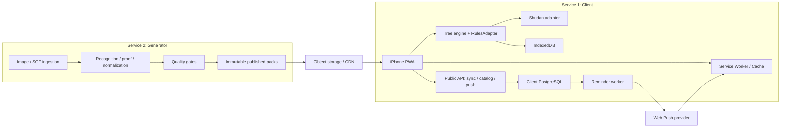
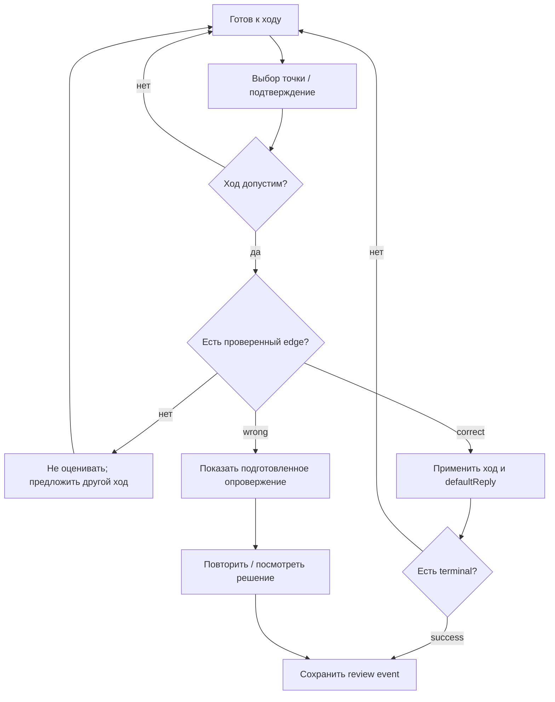

# Tsumego на iPhone: Client / PWA

**Design document 01 · версия 1.0 · 15 сентября 2026**

Статус: рекомендуемая архитектура для реализации. Исследование выполнено заново: GitHub API, исходный код, опубликованные пакеты и документация платформы. Результаты собственных измерений отделены от заявлений авторов и проектных целевых значений.

> **Статус реализации (обновлён 2026-09-15):** работа начата. Готовы workspace, ProblemV1 validation и SHA-256 contract, RulesAdapter, базовый PuzzleSession, Shudan prototype, checkpoint/restore, staged pack install, offline shell и базовая запись FSRS. Следующий шаг — daily queue. Детальная разметка `[x]` / `[ ]`: [PROGRESS.md](PROGRESS.md). Точный checkpoint для смены агента: [../HANDOFF.md](../HANDOFF.md).

Парный документ: [Problem Generator](../generator/PLAN.md). Документы описывают **два независимо развёртываемых сервиса**. Client включает PWA и небольшой публичный backend; Generator включает административный API и фоновые вычисления. Очередь, база и объектное хранилище являются инфраструктурой этих сервисов.

## 1. Решение

**Выбрать React + TypeScript + Vite, Shudan 1.8.0 через адаптер и простую тему без растровой текстуры.** Проверку ходов и прохождение учебного дерева держать в собственном небольшом модуле. Shudan отвечает за изображение доски и события ввода. Для операций с камнями использовать `@sabaki/go-board` под общим адаптером правил; историю повторений контролирует наш модуль. SGF разбирается в Generator, поэтому его парсер не входит в основной клиентский путь.

OGS Goban остаётся обоснованной альтернативой для будущего редактора партий, игры по сети или большого анализа вариантов. Для текущего продукта его готовая Go-логика и режим puzzles перекрываются с нашим контрактом проверенных задач. Преимущество Shudan здесь — управляемое извне состояние и простая замена внешнего вида, а не популярность Sabaki.

| Область | Финальный выбор | Почему |
|---|---|---|
| Доска | Shudan, React aliases, собственная CSS-тема | Прямые `signMap`, markers, crop и события; минимум состояния внутри renderer |
| Правила | Общий `RulesAdapter` поверх `@sabaki/go-board` | Одинаковые captures, suicide и история в нормализаторе и клиенте |
| Решение задачи | Детерминированный интерпретатор ProblemV1 | Ни запрос к AI, ни сеть не нужны для каждого хода |
| Хранение | IndexedDB через Dexie; Cache Storage для оболочки | Транзакционный прогресс и отдельное обновление приложения |
| Повторения | `ts-fsrs`, зафиксированные версия и параметры | Готовый алгоритм SRS; воспроизводимый пересчёт по событиям |
| Backend Client | TypeScript / Fastify, PostgreSQL, Web Push worker | Каталог, необязательная синхронизация, напоминания |
| Доставка контента | Неизменяемые пакеты JSON через CDN | Контент обновляется независимо от PWA |
| Первый выпуск | 100–300 разрешённых к распространению задач | Качество веток важнее размера каталога |

Предположение: возможность коммерческого использования должна сохраняться. Это не означает, что весь проект обязан быть закрытым. Лицензии кода, моделей и самих задач учитываются отдельно.

## 2. Цели и границы MVP

Пользователь устанавливает приложение на домашний экран, скачивает набор, решает короткую ежедневную сессию без сети и получает повторения по своим ошибкам. Цель задачи, сторона хода и целевая группа видны до первого действия.

**В MVP входят:** обучение на precomputed trees, несколько правильных ходов, показ подготовленного опровержения, offline packs, сохранение незаконченной попытки, SRS, установка PWA, Web Push по добровольной подписке, экспорт прогресса. Для синхронизации между устройствами нужен аккаунт; локальная практика работает без аккаунта.

**После MVP:** полноценные ko/seki-задачи, редактор пользователя, социальные функции, игра по сети, генерация новых задач непосредственно из клиентского интерфейса. Возможность pan/zoom нужна уже в MVP, но стартовый каталог преимущественно состоит из компактных угловых и боковых позиций.

Устройство для приёмки: реальный iPhone SE / аналогичный экран 375 CSS px и обычный iPhone. Целевой baseline приложения — iOS 17+, дополнительно проверяется актуальная стабильная iOS. Web Push появился раньше, в iOS 16.4, но это само по себе не означает поддержку всего приложения на всех старых версиях. [WebKit: Web Push](https://webkit.org/blog/13878/web-push-for-web-apps-on-ios-and-ipados/)

## 3. Повторное сравнение board renderers

### 3.1 Популярность и активность

Снимок GitHub API на **2026-09-15**. `HEAD` — дата последнего коммита основной ветки; `push` может относиться к другой ветке. `updated_at` и число звёзд не используются как доказательство разработки. Звёзды полного приложения не приписываются его компоненту. На дату проверки все перечисленные репозитории имели `archived=false`.

| Проект | Stars / forks | HEAD; последний push | Лицензия и наблюдение |
|---|---:|---|---|
| [online-go/goban](https://github.com/online-go/goban) | **60 / 57** | 2026-09-11; 2026-09-11 | Apache-2.0. Последние изменения касаются реального поведения доски и move tree |
| [SabakiHQ/Shudan](https://github.com/SabakiHQ/Shudan) | **106 / 26** | 2026-08-21; 2026-09-03 | MIT. Август — dependency updates; июль — 1.8.0 и новый набор тестов |
| [SabakiHQ/Sabaki](https://github.com/SabakiHQ/Sabaki) | 2 775 / 412 | 2026-08-11; 2026-09-13 | MIT. Это Electron-приложение, а не npm renderer |
| [yewang/besogo](https://github.com/yewang/besogo) | 137 / 35 | 2025-06-21; 2025-06-21 | MIT для кода; отдельные bundled assets имеют CC-лицензии |
| [waltheri/wgo.js](https://github.com/waltheri/wgo.js) | 341 / 121 | **2021-07-13**; 2025-07-26 | MIT-текст в заголовке `wgo.js`; GitHub API не определил лицензию |
| [jokkebk/jgoboard](https://github.com/jokkebk/jgoboard) | 123 / 26 | 2026-05-12; 2026-05-12 | Текущий 5.0.4: **CC-BY-NC-4.0**. Старые обзоры MIT нельзя переносить на новую версию |
| [kaya-go/kaya](https://github.com/kaya-go/kaya) | 116 / 14 | 2026-09-14; 2026-09-14 | AGPL-3.0; целое React/PWA-приложение, внутри свой пакет shudan |

Метаданные доступны через первичные API: [OGS](https://api.github.com/repos/online-go/goban), [Shudan](https://api.github.com/repos/SabakiHQ/Shudan), [BesoGo](https://api.github.com/repos/yewang/besogo), [WGo](https://api.github.com/repos/waltheri/wgo.js), [jGoBoard](https://api.github.com/repos/jokkebk/jgoboard), [Kaya](https://api.github.com/repos/kaya-go/kaya). Это изменяемые страницы; числа выше относятся к зафиксированному снимку.

### 3.2 Функциональность и пригодность

| Вариант | Рисование и настройка | API / архитектура | Интеграция и mobile/PWA |
|---|---|---|---|
| **OGS Goban** | Canvas и SVG, темы, координаты, markers, heatmaps, bounds, дерево вариантов | TypeScript; imperative constructor + events; Go engine, puzzle modes, сетевой слой | Хорошая основа для комплексного Go UI. В React нужен lifecycle wrapper. PWA работает без OGS-сервера, но renderer несёт дополнительную логику |
| **Shudan** | DOM/SVG, CSS variables, markers, arrows, heatmap, animation, fuzzy placement, partial board | Низкоуровневый Preact-компонент; `signMap` и callbacks; правил игры нет | Наиболее простой controlled adapter. React поддержан aliases. Pointer events есть; управление жестами, доступность и hit targets проектируем сами |
| **BesoGo** | SVG, CSS-темы, SGF viewer/editor, панели | Vanilla JS без внешних библиотек, собственный editor state и глобальный namespace | Удобен для встраивания SGF viewer. Наш runtime-формат потребует адаптации его модели; часть SGF properties игнорируется |
| **WGo.js** | Canvas, custom drawing objects, cut-outs | Отдельные Board/Game/Player, глобальный `WGo` | Маленькое ядро; старый API и редкая разработка. Автор заявляет iPhone, но это не свежий Safari benchmark |
| **jGoBoard 5** | Canvas, presets, собственные renderer/core/player/sgf exports | Современный TypeScript, ESM/CJS, модульные entry points | Технически сильный кандидат; NC-лицензия исключает из принятого коммерчески совместимого baseline |
| **Kaya shudan** | React-вариант доски, темы в составе приложения | Монорепозиторий, связь с общими UI/Go-пакетами | Есть работающая PWA как reference. Извлечение пакета и AGPL усложняют старт по сравнению с upstream Shudan |

Подтверждения: [OGS API](https://docs.online-go.com/goban/interfaces/GobanConfig.html), [Shudan API](https://github.com/SabakiHQ/Shudan/blob/bf2be30c568338c77294a782742036c1b3167c72/docs/README.md), [BesoGo README](https://github.com/yewang/besogo/blob/4f03a3a04bc632c49ca9b494cbcad5c7cfb3f6b2/README.md), [WGo README](https://github.com/waltheri/wgo.js/blob/34773562647e4e8c9c33f1a29cc3183fd1de90d8/README.md), [jGoBoard package](https://github.com/jokkebk/jgoboard/blob/1629e01f6a2cca73c5ad2d59401b3e87356455bc/package.json), [Kaya architecture](https://github.com/kaya-go/kaya/blob/8803223bda13970d4d1bd79f7048fc0cd452e7f6/docs/ARCHITECTURE.md).

### 3.3 Что показал код OGS и Shudan

У OGS абстрактный `Goban` наследуется от `OGSConnectivity`. Публичный entry point экспортирует engine, renderers, themes, protocol и другие части. Штатная web-сборка — UMD. Вызов `new GobanCanvas({...})` создаёт собственный engine; приложение должно аккуратно синхронизировать его с учебным состоянием. Это не означает обязательный OGS backend: наш минимальный mount не выполнял внешних сетевых запросов. [Goban.ts](https://github.com/online-go/goban/blob/fe8be0369f7c381d8daca1056f9cb4a0a3794cfd/src/Goban/Goban.ts), [entry point](https://github.com/online-go/goban/blob/fe8be0369f7c381d8daca1056f9cb4a0a3794cfd/src/index.ts), [build configuration](https://github.com/online-go/goban/blob/fe8be0369f7c381d8daca1056f9cb4a0a3794cfd/webpack.config.js).

Shudan экспортирует `Goban` и `BoundedGoban`. Он принимает `signMap[y][x]`, где B=1, W=-1, empty=0. `rangeX/rangeY` управляют видимой областью без изменения исходной доски. Для React документированы aliases **`preact` → `react` и `preact/hooks` → `react`**; нужны точные правила разрешения импортов, чтобы общий alias не затмил hooks. События содержат vertex, а правила и grading остаются снаружи. [Shudan main](https://github.com/SabakiHQ/Shudan/blob/bf2be30c568338c77294a782742036c1b3167c72/src/main.js), [Goban](https://github.com/SabakiHQ/Shudan/blob/bf2be30c568338c77294a782742036c1b3167c72/src/Goban.js).

Состояние учебной задачи нельзя хранить одновременно в renderer и нашем engine как два равноправных источника истины. Эта проблема решается проще с Shudan. OGS выбираем при существенном расширении scope: SGF editing, online play, scoring и обзоры партий, когда его возможности заменят наш код.

### 3.4 Собственный замер bundle

Метод: Node 23.9.0, esbuild 0.25.12, production minify, target `safari17`; React/ReactDOM 19.1.1 одинаковы во всех сборках. Shudan **1.8.0**, Goban **8.3.226** из npm. Одна 9×9 доска; импорт renderer, обработчик события и React mount. Gzip level 9, 1 KiB=1024 bytes. Это **размер выходных файлов**, не скорость на iPhone.

| Сборка | JS min / gzip | CSS + встроенные assets gzip | Сумма gzip |
|---|---:|---:|---:|
| React baseline | 182.1 / 56.9 KiB | 0 | 56.9 KiB |
| Shudan, штатная тема с assets inline | 194.0 / 61.2 KiB | 194.8 KiB | 256.0 KiB |
| **Shudan, простая тема** | **194.0 / 61.2 KiB** | **1.8 KiB** | **63.0 KiB** |
| OGS Canvas, стандартный npm entry | 573.0 / 153.6 KiB | 0 в этой конфигурации | 153.6 KiB |

Разница относительно baseline: около **6.1 KiB** для Shudan с простой темой и **96.7 KiB** для OGS. Измерение штатной Shudan-темы специально включает её растровый `board.png`; при вынесении в отдельный файл меняется распределение запросов, а не исчезает стоимость текстуры. Простая тема удаляет ссылки на изображения на этапе сборки: CSS override поверх импортированной темы может сохранить ненужную загрузку.

Для масштаба: проверенные готовые файлы WGo core — 25 784 bytes / 6 863 gzip; player — дополнительно 50 620 / 14 073. Это другие функции и другой build, поэтому эти числа не являются прямым сравнением всего приложения. У BesoGo, jGoBoard и Kaya production bundle в этом исследовании не измерялся.

Оба основных renderer успешно создали доску в headless Chrome при viewport 390×844, без JavaScript errors и внешних запросов. Shudan создал 81 vertex; OGS — два canvas. Это проверка mount, **не проверка жестов, VoiceOver, FPS или реального Safari**. WebKit runtime отсутствовал, поэтому соответствующих результатов нет. Никаких выводов о превосходстве FPS из этих измерений не делаем.

### 3.5 Почему финально Shudan

Наше приложение не решает задачу в браузере. Поэтому приоритеты: точное отображение сохранённого состояния, управление вводом пальцем, независимость grading от renderer и простая тема. Shudan лучше соответствует этой модели и имеет небольшой измеренный бюджет. OGS активнее в предметной разработке и даёт больше функций; его меньшие stars не являются недостатком качества. В итоговом выборе учтены оба обстоятельства.

## 4. Архитектура двух сервисов



Generator не читает пользовательскую базу, push subscriptions и SRS. Client не имеет доступа к GPU workers, исходным приватным изображениям и административной очереди. Генератор публикует manifest и объекты; Client индексирует только опубликованный каталог. Физически это могут быть два проекта или один monorepo с двумя deploy targets. Общий versioned package содержит только schema, rules profile и conformance fixtures.

### 4.1 Модули PWA

| Модуль | Ответственность |
|---|---|
| `BoardAdapter` | Камни, координаты, crop, highlights; преобразование pointer в canonical point |
| `RulesAdapter` | Legality, capture, suicide, pass, история повторов; без оценки жизни |
| `PuzzleSession` | Один активный node, путь, попытка, подсказки, опровержение |
| `PackStore` | Скачивание, hash validation, staged install, удаление набора |
| `ProgressStore` | Review events, текущая попытка, SRS projection, outbox |
| `SyncClient` | Повторяемая доставка событий, cursor, разрешение конфликтов |
| `ReminderSettings` | Permission flow, subscription и расписание |

`@sabaki/go-board` даёт операции над доской; это не замена полной политике повторений и не life-and-death judge. Wrapper проверяет историю и результаты против общих fixtures. [API go-board](https://github.com/SabakiHQ/go-board)

## 5. Общий формат ProblemV1

Это публичная граница Client ↔ Generator. В этом документе дана **нормативная runtime-модель**; Generator описывает её получение и расширенный внутренний audit record. Типы ниже — спецификация, не обещание существующего SDK.

```typescript
type Color = "B" | "W";
type Point = number; // y * boardSize + x, начало вверху слева
type Move = Point | "pass";
type Verdict = "correct" | "wrong" | "unclassified";
type Outcome = "target-captured" | "unconditional-life" |
               "seki" | "ko-dependent" | "unknown";

interface ProblemV1 {
  schemaVersion: 1;
  problemId: string;             // стабильная учебная идентичность
  revision: number;              // версия опубликованного содержания
  learningVersion: number;       // меняется при смене условия / ответов
  semanticHash: string;          // SHA-256 canonical task semantics
  boardSize: 9 | 13 | 19;
  setup: { black: Point[]; white: Point[] };
  toPlay: Color;
  studentColor: Color;
  history: { policy: "fresh-position" | "provided";
             moves: Array<[Color, Move]> };
  rules: {
    profile: "ld-v1";
    suicide: "forbidden";
    repetition: "situational-superko";
    externalKo: "none";
    pass: "allowed";
  };
  goal: {
    kind: "capture" | "live";
    targetColor: Color;
    anchors: Point[];            // идентичности камней в setup
    quantifier: "all-captured" | "any-unconditionally-alive";
    seki: "unsupported";
    ko: "unsupported";
  };
  viewport: { x0: number; y0: number; x1: number; y1: number };
  nodes: NodeV1[];               // ID узла = индекс
  root: number;
  verification: {
    level: "solver-checked" | "expert-reviewed";
    auditId: string;
    adapterVersion: string;
    scope: "declared-position-and-rules";
  };
  source: { collection: string; attribution: string;
            licenseId: string; sourceUrl?: string };
  difficulty: { band: string; status: "estimated" | "calibrated" };
  tags: string[];
}

interface NodeV1 {
  toPlay: Color;
  stateHash: string;             // board + turn + rule/history context
  edges: Array<{
    move: Move;
    next: number;
    verdict: Verdict;           // относительно цели STUDENT
    role: "solution" | "opponent" | "refutation";
    explanationId?: string;
  }>;
  coverage: {
    kind: "listed-only" | "all-legal";
    defaultVerdict: "unclassified";
  };
  defaultReply?: number;        // индекс edge; только на ходе противника
  terminal?: {
    result: "success" | "failure";
    outcome: Outcome;
    explanation: string;
  };
}
```

### 5.1 Обязательная семантика

1. `setup` — полная стартовая доска; `history.moves` воспроизводится поверх setup до `root`. Для `fresh-position` moves пусты. История SGF не отбрасывается молча. Если она недоступна, задача явно задаёт новую позицию без предшествующей истории.
2. `viewport` задаёт только картинку. За пределами viewport есть та же доска; добавление стены или уменьшение `boardSize` меняет задачу и её `semanticHash`.
3. `anchors` отслеживают **исходные камни**, а не просто занятость клеток позднее: камень, поставленный на место взятого, не становится прежней целью. Captures и identity tracking проверяются генератором и общими fixtures.
4. `capture` требует `all-captured`; `live` — `any-unconditionally-alive`. Другие значения требуют нового rules profile. «Не удалось доказать жизнь» не равно «доказано взятие».
5. `ld-v1` использует situational superko и отсутствие внешних ko threats. Pass допускается отдельно от проверки повторения позиции; два pass не означают автоматический успех задачи. Ko-зависимые и seki-исходы не становятся success/failure в MVP. Если adapter решал по иной модели, пакет не получает этот профиль автоматически.
6. `correct/wrong` всегда относятся к исходной цели ученика, не к стороне текущего узла и не к сырому `UCT_WIN`. На ходе противника `correct` значит, что цель ученика остаётся достижима; `wrong` — что она опровергнута.
7. Отсутствующий edge = `unclassified`. Даже `all-legal` не разрешает default wrong: если coverage заявлен полный, но edge отсутствует, это повреждение контента.
8. Leaf не означает success. Завершение требует `terminal`; обрыв по лимиту дерева неприемлем как конечный ответ.
9. Для MVP граф ацикличен. Дедупликация разрешена только при совпадении состояния **и контекста истории/цели**. Координатно одинаковые доски с разной историей нельзя объединять.
10. `verification.level` не называется «математически сертифицировано». `solver-checked` означает результат конкретной проверенной конфигурации и replay validation; независимого полного proof checker ещё нет.

Числовые точки дают компактность без собственного бинарного протокола. Во время публикации разрешено кодировать edges tuples и хранить строки пояснений в общем словаре, но только с явным `encodingVersion`. В MVP обычный JSON + HTTP compression проще проверять и мигрировать.

### 5.2 Идентичность и manifest

`semanticHash` включает позицию, историю, правила, сторону хода и цель; исключает комментарии, labels и crop. `problemId` присваивается куратором и сохраняется при редакционных изменениях. Исправление правильного ответа увеличивает `revision` и `learningVersion`; старые попытки остаются в истории, будущие повторения переходят на новую учебную версию. Геометрические симметрии связываются одним `problemId`, но направление преобразования хранится в сессии.

Manifest содержит `packId`, `revision`, `schemaVersion`, `minClientVersion`, перечень shards `{path, sha256, bytes, expandedBytes, problemCount}`, attribution, `publishedAt` и список отозванных problem revisions. Hash считается по **исходным UTF-8 bytes shard после HTTP-decompression**. Не включаем собственный hash в хешируемое тело. Manifest передаётся по HTTPS, immutable path привязан к revision; publisher credentials недоступны клиенту.

## 6. Прохождение задачи



Порядок: inverse-transform точки → legality → edge lookup → apply → проверить `stateHash` → перейти на `next` → записать checkpoint. Renderer никогда не принимает решение о результате. Illegal tap не расходует попытку. При неизвестном ходе показываем «Этот ход ещё не проверен», оставляем ученика на исходном узле и предлагаем отправить отчёт о пропущенной ветке при появлении сети.

Ответ противника выбирается по сохранённому `defaultReply`. В дополнительном режиме «Все защиты» пользователь выбирает ветку из опубликованного списка. Случайный выбор не применяется в MVP. Позднее можно зафиксировать seed попытки и выбирать между доказанными защитами; одна и та же попытка должна воспроизводиться.

После wrong запускается **demonstration mode**: сохранённые шаги опровержения показываются вперёд/назад с подписью причины. Это не свободная игра за обе стороны. Если опровержение требует ветвления, оно также предвычислено. В произвольной позиции вне дерева AI-ответ не запрашивается и штраф не выставляется.

Ошибка, подсказка или просмотр ответа фиксируются до retry. Повторное прохождение уже показанной ветки в той же попытке не превращает её в успешное воспоминание для SRS. Незаконченная попытка после закрытия приложения восстанавливается с того же revision и node.

## 7. iPhone UX

Основной экран: короткое условие и target marker сверху; доска по центру; снизу одна строка состояния и большие кнопки «Назад», «Подсказка», «Дальше». Правильность не передаётся только красным/зелёным цветом. Начальная целевая группа выделена контуром; условие доступно VoiceOver текстом.

| Ситуация | Поведение |
|---|---|
| Маленькая локальная позиция | Crop с запасом; стараться сохранить 32–44 CSS px между пересечениями |
| Плотная / полная 19×19 | Pan/zoom и выбор с preview + отдельным подтверждением; не обещать 44 px на всех 361 точках сразу |
| Палец перекрывает intersection | Ghost stone и увеличенный preview выше пальца; постановка после подтверждения |
| Pointer cancel / прокрутка | Снять preview; не ставить камень |
| Ответ противника | Заблокировать повторную постановку до завершения transition; один ход на pointer sequence |
| Поворот экрана | Пересчитать layout; canonical coordinate, node и review не меняются |
| Нижняя панель iPhone | `safe-area-inset-bottom`, dynamic viewport height; кнопки не под Home Indicator |
| Reduced motion | Отключить bounce/fuzzy animation, сохранить мгновенный результат |
| Без звука / haptics | Всё понятно визуально и текстом; вибрация не считается обязательной API |

Native page zoom не блокировать глобальным `user-scalable=no`. Перехват жестов ограничивается доской. Для кнопок принимать 44×44 CSS px как проектный минимум; для координатной сетки доступна альтернативная навигация: roving focus и выбор точки по координате. Полную доступность Shudan из наличия DOM/SVG не выводим — она требует проверки VoiceOver.

Установка и push предлагаются **после первой полезной сессии**. На iPhone даём адаптивную подсказку по Share → Add to Home Screen. В Safari 26 установка получила режим Open as Web App; не полагаемся на старый неизменный screenshot инструкции. [WebKit Safari 26](https://webkit.org/blog/17333/webkit-features-in-safari-26-0/)

## 8. Offline-first: IndexedDB, cache и обновления

### 8.1 Владение данными

| Хранилище | Ключ / содержимое | Политика |
|---|---|---|
| IDB `packs` | `(packId, revision)`, manifest, install state | staged → ready; пользователь видит только ready |
| IDB `problems` | `(problemId, revision)`, immutable JSON | Читается локально; индекс по tags/difficulty |
| IDB `sessions` | `attemptId`, путь, revision, hints, transform | Checkpoint после каждого подтверждённого хода |
| IDB `reviewEvents` | `eventId`, результат одной попытки | Append-only; источник истины прогресса |
| IDB `cards` | `(problemId, learningVersion)`, SRS projection | Можно пересобрать из событий |
| IDB `outbox` | eventId / payload / retry state | Изменение вместе с review в одной транзакции |
| IDB `settings` | локаль, тема, reminder preferences | Экспортируемые пользовательские настройки |
| Cache Storage | hashed app shell, icons, fonts | По версии service worker; без приватных API responses |

Пакеты скачиваются при открытом приложении. Последовательность: проверить свободное место → получить manifest → скачать shards во временную область → проверить hash, schema, лимиты и граф → одной короткой IDB-транзакцией переключить указатель активной версии. Сеть не держим внутри IDB-транзакции. При сбое остаётся предыдущий ready pack. Старая revision удаляется после завершения использующих её сессий.

Новый Service Worker ждёт безопасной точки. Не вызываем принудительное обновление посреди решения; после checkpoint показываем «Обновление готово». Сервер сохраняет старые hashed assets достаточно долго для старой оболочки. Новая версия content schema требует явного reader; неизвестная major version не загружается. Для IDB migration — versioned upgrade, обработка blocked/versionchange и восстановление projection из событий.

### 8.2 Ограничения iOS

`navigator.storage.estimate()` и `persist()` помогают оценить и запросить хранение, но не превращают телефон в гарантированное постоянное хранилище. WebKit может удалить данные при нехватке места; отказ quota обрабатывается как обычное состояние. Не обещаем пользователю, что установка PWA исключает потерю локального прогресса. Предусмотрены экспорт и необязательная синхронизация. [WebKit storage policy](https://webkit.org/blog/14403/updates-to-storage-policy/)

Синхронизация вызывается при foreground, после review и после восстановления сети. `online` является поводом попробовать запрос, а не доказательством доступности сервера. На Background Sync / Periodic Background Sync приложение не опирается. Незавершённые uploads и downloads продолжаются при следующем запуске. [MDN Background Sync](https://developer.mozilla.org/en-US/docs/Web/API/Background_Synchronization_API)

Проектные бюджеты: стартовая оболочка ≤200 KiB gzip JS+CSS; downloaded pack 100 задач обычно целить в ≤5 MiB expanded; приложение предупреждает перед большими наборами. Это целевые значения до реализации, не измеренный размер готового продукта. Лимиты на отдельную задачу: 10 000 nodes, 40 000 edges, 200 plies и 2 MiB expanded; превышение возвращается генератору для отбора веток.

## 9. Progress и SRS

Использовать `ts-fsrs` с фиксированными параметрами, начальной retention 0.90 и выключенным случайным fuzz. Изменение scheduler version не переписывает прошлые события. Библиотека имеет MIT-лицензию и TypeScript API; оценка retention здесь — продуктовая настройка, не заявленная эффективность на tsumego. [ts-fsrs](https://github.com/open-spaced-repetition/ts-fsrs)

| Результат попытки | Rating |
|---|---|
| Ошибка или просмотр решения | Again |
| Решено с подсказкой | Again; допускается отдельный негрейдируемый learning повтор |
| Самостоятельно, с усилием | Hard по явному выбору пользователя |
| Самостоятельно | Good по умолчанию |
| Самостоятельно и легко | Easy по явному выбору |
| Неизвестный ход, ошибка данных, прерывание | Не изменять SRS |

Не выводим mastery только из скорости: пользователь мог отвлечься. Карточка связана с задачей, а не с каждым поворотом доски. Дневная очередь: due reviews → ограниченное число новых задач → добровольная дополнительная практика. Повтор сразу после просмотра решения помечается practice и не создаёт второй обычный review.

`ReviewEvent` содержит `eventId`, `attemptId`, `problemId`, `revision`, `learningVersion`, `deviceId`, `deviceSeq`, `occurredAt`, `timezone`, `rating`, `firstTryCorrect`, `hintCount`, `solutionViewed`, `path`, `schedulerVersion`. Exactly-once эффект обеспечивается unique eventId и attemptId на сервере, даже если доставка at-least-once.

При multi-device sync сервер ведёт канонический журнал и projection. Для одной карточки события упорядочиваются по нормализованному occurredAt, затем deviceId/deviceSeq/eventId; подозрительный clock skew отмечается и ограничивается серверным временем приёма. Поздние события вызывают пересчёт карточки. Клиент заменяет projection серверной и поверх накладывает ещё не подтверждённый outbox. Не объединять due dates через `max()` и не сливать состояния FSRS произвольно. Concurrent reviews с разными attemptId сохраняются; дубли одной попытки исключаются.

## 10. Push notifications и напоминания

Push обслуживает **Client service**. Серверный scheduler выбирает подписки по локальному расписанию, отправляет стандартный Web Push с VAPID; service worker показывает notification. Секретный VAPID key остаётся на backend. Service worker не используется как будильник с длительным JavaScript timer.

На iPhone подписка возможна у Home Screen web app после прямого действия пользователя. При denied повторный prompt не вызывается бесконечно; интерфейс объясняет, где изменить настройку. Каждое push-событие должно вести к видимому уведомлению; silent push для постоянной синхронизации не предусмотрен. [Apple Web Push](https://developer.apple.com/documentation/usernotifications/sending-web-push-notifications-in-web-apps-and-browsers)

### 10.1 Расписание

Храним IANA timezone, local time, days of week, enabled, quiet hours, nextSendAt, timezonePolicy=`follow-device-on-next-open`. При изменении зоны на телефоне обновляем сервер при следующем foreground. Для пропущенного времени перехода DST выбираем следующее допустимое местное время; для повторяющегося — только первое. Dedup key: `(subscriptionId, localDate, scheduleVersion)`; одна reminder notification в сутки по умолчанию.

При отсутствии свежей синхронизации напоминание нейтральное: «Время для нескольких задач». Точное «Осталось 7 повторений» допустимо только при свежем серверном projection. Если офлайн-сессия уже состоялась, сервер может этого не знать. Push — best effort: Focus, сеть и OS могут задержать доставку; обещание «строго в 20:00» в продукте не даём.

Ответы 404/410 удаляют subscription; 429/5xx запускают bounded retry с jitter и TTL до конца окна напоминания. Worker имеет уникальный lease на отправку. Нажатие открывает `/practice/today`; маршрут работает с локальным набором, а при его отсутствии предлагает загрузку. Истёкший login не блокирует локальную сессию.

Declarative Web Push можно добавить как улучшение для новых WebKit; стандартный service-worker путь остаётся baseline. Это не локальный планировщик. [WebKit Declarative Web Push](https://webkit.org/blog/16535/meet-declarative-web-push/)

## 11. API Client service

| Endpoint | Контракт и ошибки |
|---|---|
| `GET /v1/catalog` | Published pack metadata, ETag, revocations, совместимость schema |
| `GET /v1/packs/{id}/{revision}/manifest` | Immutable manifest; 404 для неизвестной версии |
| `POST /v1/reviews:batch` | ≤100 events; idempotency по eventId; acknowledged IDs, canonical card updates, cursor |
| `GET /v1/sync?cursor=...` | Events / settings / projection changes; 410 expired cursor → resync |
| `PUT /v1/devices/{id}/push-subscription` | endpoint + p256dh + auth, ownership; 422 malformed |
| `DELETE /v1/devices/{id}/push-subscription` | Отмена server subscription; клиент вызывает unsubscribe |
| `PUT /v1/reminder` | localTime, timezone, days, enabled; version для optimistic concurrency |
| `POST /v1/problem-reports` | problemId/revision/nodeId/move/path/reason; outbox допустим |
| `GET /v1/me/export` | Пользовательский прогресс и настройки в переносимом JSON |
| `DELETE /v1/me` | Удаление аккаунта, событий и подписок по политике хранения |

Catalog доступен без аккаунта. Reviews/sync используют аутентификацию; web-приложение работает на том же origin с secure HttpOnly SameSite cookie, CSRF-защитой mutations. Push-only guest получает серверную install identity; одного произвольного deviceId для авторизации недостаточно. Limits, JSON schema и ownership проверяются сервером. Идемпотентная повторная batch delivery не начисляет дополнительные reviews.

## 12. Надёжность, безопасность и наблюдаемость

Данные SGF и пояснения считаются недоверенными: в клиент попадает plain text или ограниченный санитизированный формат. Нельзя вставлять source comments в `innerHTML`. CDN не размещает пользовательские scripts. CSP, pin dependencies, TLS и проверка размеров защищают оболочку и importer.

Push endpoint — секретный capability URL: не писать целиком в logs. Отправщик проверяет endpoint scheme и адреса назначения, запрещает loopback/private networks, redirects и DNS rebinding; допустимы только поддержанные публичные push-провайдеры. Это особенно важно, потому что endpoint присылает клиент.

Метрики: offline launch success, pack install failures, missing-edge rate, stateHash mismatch, review dedup, outbox age, subscription churn, push provider acceptance. Acceptance не называется доставкой пользователю. Ошибка графа выключает конкретную revision, даёт локальное объяснение и исключает попытку из SRS. Critical revocation применяется при следующем соединении; мгновенно отозвать уже скачанный офлайн-контент невозможно.

### 12.1 Риски и действия

| Риск | Вероятность / ущерб | Решение / критерий |
|---|---|---|
| Правильный ход отсутствует | Высокая / высокий | unknown без штрафа; coverage gate в Generator |
| Слишком мелкая сетка | Высокая / высокий | Preview, zoom и crop; испытание на 375 px |
| Потеря IDB | Средняя / высокий | Export, optional sync, восстановление пакетов |
| Update ломает активную сессию | Средняя / высокий | Pin revision, staged install, миграционные fixtures |
| Две несовместимые модели правил | Средняя / критический | Shared conformance suite; reject mismatched profile |
| Слабая поддержка Shudan | Средняя / средний | Adapter; небольшой vendor fork с MIT notices при необходимости |
| Push не приходит вовремя | Средняя / низкий | Best-effort UX, in-app due queue, без точных обещаний |
| Dataset нельзя распространять | Средняя / высокий | Publish gate по provenance, отдельный от code licensing |

## 13. MVP roadmap и критерии готовности

Оценка — **6–8 календарных недель для двух инженеров и Go-куратора неполный день**, вместе с этапами Generator. Это planning estimate, а не обещание throughput. Неделя 1 проверяет главные неизвестные до масштабирования каталога.

| Этап | Объём | Выходной критерий |
|---|---|---|
| 0 · 3–5 дней | Contracts, renderer adapter, 20 вручную проверенных fixtures, iPhone prototype | Цель/координаты не расходятся; жесты удобны на реальном iPhone |
| 1 · 1–2 недели | Tree interpreter, captures, альтернативы, refutation, checkpoint | 100% опубликованных путей проигрываются; unknown никогда не wrong |
| 2 · 1 неделя | IDB, packs, offline shell, versioning | Cold start в airplane mode после force quit; interrupted download сохраняет старый pack |
| 3 · 1 неделя | SRS, export, daily queue, первый каталог | Один event на попытку; replay журнала воспроизводит карточки |
| 4 · 1–2 недели | Public API, optional account sync, push | Duplicate delivery, DST и 410 subscriptions обработаны; реальное устройство получает test push |
| 5 · 1 неделя | Accessibility, content QA, beta | 100–300 задач, 10–20 пользователей, нет критических false-wrong reports |

Обязательная проверка перед beta: реальные Safari и Home Screen mode; 375/390 px; offline + network flap; low storage; SW/IDB upgrade во время сессии; alternate correct moves; invalid/pass/capture/repetition fixtures; multi-device event order; VoiceOver; denied/revoked push; DST. Браузерная эмуляция не заменяет установку и push на iPhone.

## 14. Итог исследования и ограничения

**Shudan подтверждён как лучший renderer для этого scope**, после проверки OGS по коду и сборке. OGS вовсе не чрезмерно тяжёлый: он остаётся сильной заменой, если продукт расширится до редактора и online Go. Текущий выигрыш Shudan — более простое владение состоянием и темой.

Подтверждены: live stars/activity/license snapshot; source API; два production bundle; Chrome mount; ограничения iOS по первичным документам. Не измерены: FPS/энергия/VoiceOver на iPhone, размер финального pack, production SRS retention и доставляемость напоминаний. Это явные acceptance gates реализации, а не скрытые предположения.

Весь клиентский дизайн опирается на одно продуктовое правило: **мы оцениваем только те ходы, для которых Generator поставил проверенный результат, и сохраняем неопределённость во всех остальных случаях.**
