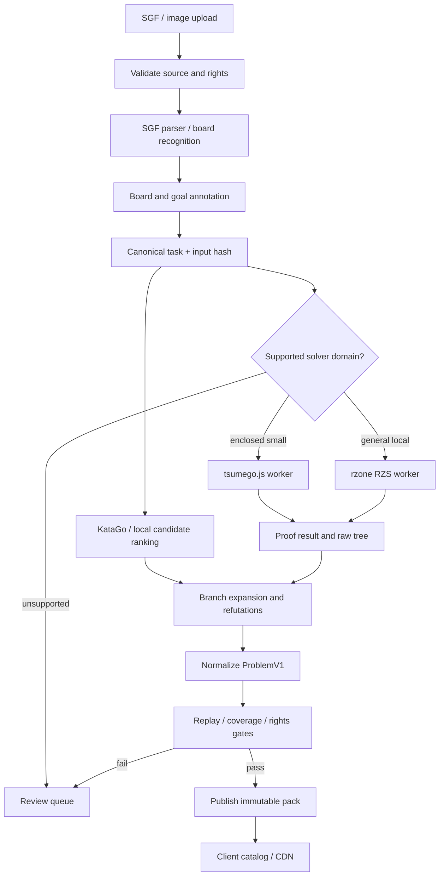
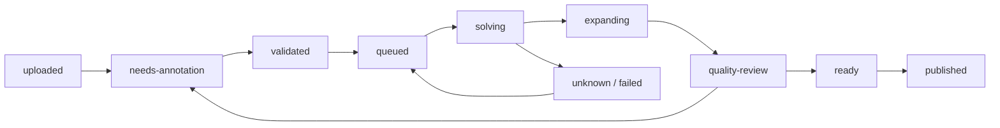

# Tsumego: Problem Generator pipeline

**Design document 02 · версия 1.0 · 15 сентября 2026**

> **Статус реализации (обновлён 2026-09-16):** SGF import и два CPU adapters реализованы как локальный vertical slice. `tsumego.js` обслуживает малые закрытые области; GNU Go Owl на macOS выдаёт только review-кандидаты и partial SGF trees. Общий ProblemV1 ведётся в `../packages/problem-contract`. Детальная разметка: [PROGRESS.md](PROGRESS.md). Точный checkpoint: [../HANDOFF.md](../HANDOFF.md).

Статус: рекомендуемая архитектура для реализации. Парный документ: [Client / PWA](../client/PLAN.md). Generator — отдельный сервис: он преобразует изображения и SGF в проверенные учебные пакеты. Client получает эти пакеты и детерминированно воспроизводит их без солвера на телефоне.

## 1. Финальное решение

**Выбрать pipeline с несколькими строго ограниченными solver adapters, основой общего proof-поиска сделать семейство RZS.** Конкретный production baseline для этого семейства — `rockmanray/rzone` с GPL-3.0, в отдельном server-side worker. `tsumego.js` 1.1.0 использовать как быстрый путь для маленьких замкнутых позиций. `study-LD-RZ` / RZS-PT — предпочтительное техническое развитие, но его нельзя сделать безусловной зависимостью выпуска: явная лицензия не найдена. KataGo используется для ранжирования кандидатов и учебных ошибок.

Это фиксированный routing, а не голосование AI-моделей:

| Вход / потребность | Выбранный путь |
|---|---|
| Размеченный SGF с решением | Import → replay → проверка annotations → поиск пропущенных альтернатив → curator gate |
| Маленькая, полностью замкнутая задача | `tsumego.js` adapter; строгий admission check; бюджет CPU |
| Открытая / сложная локальная задача | `rzone` RZS worker; проверка цели, правил и области |
| Локальная разработка без CUDA | GNU Go Owl: candidate moves + partial SGF; всегда `unknown` и curator review |
| Более эффективный pattern-table поиск | Подключить `study-LD-RZ` RZS-PT после license + correctness gates |
| Правдоподобные ошибки и ответы | Локальные эвристики + опциональный KataGo, включая human SL profile |
| Screenshot / печатная диаграмма | Собственный небольшой OpenCV recognizer + обязательная проверка доски |
| Фото физической доски | Поздний Moku adapter после проверки прав на веса; в MVP ручные grid anchors и correction UI |
| Не доказано / неподдержанная семантика | `unknown` / review queue; не публиковать как автоматически доказанное |

Запуск MVP не зависит от того, насколько быстро удастся стабилизировать старый C++ worker: первую beta составляют 100–300 разрешённых задач с проверенными решениями и малые задачи, прошедшие CPU lane. Полный RZS lane включается только после прохождения gate, но его контракт и место в pipeline проектируются сразу.

Предположение: client должен сохранять возможность закрытого и коммерческого распространения. GPL-код worker не встраивается в PWA. Для распространяемых модификаций worker сохраняется GPL и предоставляется соответствующий исходный код. Разделение процессов — архитектурная граница, а не универсальный способ снять лицензионные обязательства. Права на исходные диаграммы, решения и веса проверяются отдельно.

## 2. Что исправлено относительно предыдущего исследования

1. **`tsumego.js` умеет больше одного winning move.** В `Solver` есть `proofs()`, `threats()` и generator `tree()`, который возвращает SGF. Однако он может передавать управление вызывающему UI для выбора ответа противника. Это основа автоматизации, а не готовый unattended exporter. [Исходник Solver](https://github.com/d180cf/tsumego.js/blob/58a079aac928c7bd59dc398d014f1f2b743f692e/src/solver.ts)
2. **`rzone` тоже сохраняет дерево.** `saveSolutionTree()` пишет `uct_tree_<name>.esgf` через `getTsumeGoTree()`. Формат и annotations нужно разбирать, хотя README акцентирует JSON. [TsumegoSolver.cpp](https://github.com/rockmanray/rzone/blob/325e0ecd506dfebd547a9d7329829a9d8c1b7b12/CGI/TsumegoSolver.cpp)
3. **117/117 — опубликованный best-of результат.** Это не один гарантированно успешный запуск и не доказательство способности решать любой источник tsumego. В исследовании ниже указаны объём набора, повторы и изменение числа потоков. [Первичный отчёт эксперимента](https://media.patentllm.org/blog/gpu-inference/tsumego-rtx5090)
4. **RZS-пример решает `masked_sgf_str`, а не `rawsgf`.** Подстановка маски и координат — часть условия задачи. Нельзя получить proof для искусственной стены и незаметно объявить его доказательством исходного screenshot. [study-LD-RZ input handling](https://github.com/rlglab/study-LD-RZ/blob/be5c678694b3d2326e9924dad4443e0910d52cdc/CGI/TsumegoSolver.cpp)
5. **Нет универсального «exact tsumego» без заданной цели.** Unconditional life, сохранение всех исходных камней, seki и выигрыш ko — разные предикаты. Ни отсутствие life-proof, ни высокое winrate не доказывают capture.

## 3. Исследование solvers

### 3.1 Stars, активность и лицензии

Снимок GitHub API на **2026-09-15**. HEAD — последний commit основной ветки. `push` иногда новее HEAD и не доказывает обновление основной реализации. Отсутствие распознанного SPDX в API проверялось по тексту файлов и package metadata.

| Solver / repository | Stars / forks | HEAD; push | Лицензия / зрелость |
|---|---:|---|---|
| [study-LD-RZ](https://github.com/rlglab/study-LD-RZ) | **2 / 1** | 2026-02-04; 2026-02-04 | Явная лицензия не найдена; один initial commit, исследовательский выпуск |
| [rockmanray/rzone](https://github.com/rockmanray/rzone) | **0 / 0** | 2023-05-17; 2023-05-17 | **GPL-3.0**; последняя правка README; небольшая исследовательская кодовая база |
| [d180cf/tsumego.js](https://github.com/d180cf/tsumego.js) | **29 / 7** | 2017-11-21; 2018-05-28 | **Apache-2.0 заявлена в package.json/npm**; отдельный LICENSE не найден |
| [cameron-martin/tsumego-solver](https://github.com/cameron-martin/tsumego-solver) | 43 / 6 | 2020-07-06; 2020-07-08 | Явная лицензия не найдена; Rust 2018-era dependencies |
| [lightvector/KataGo](https://github.com/lightvector/KataGo) | **5 108 / 763** | 2026-09-13; 2026-09-13 | MIT для основного кода; third-party exceptions перечислены в LICENSE |
| [geovens/AQ-PS](https://github.com/geovens/AQ-PS) | 19 / 3 | 2018-02-06; 2018-02-06 | MIT; старый life-and-death-oriented bot |
| [online-fine-tuning-solver](https://github.com/rlglab/online-fine-tuning-solver) | 6 / 0 | 2023-10-30; 2023-10-30 | Явная лицензия в верхнем репозитории не найдена; система для 7×7 Killall-Go |
| GoTools / Tsumego Explorer | N/A | Исторические публикации | Публичный актуальный deployable OSS package с ясной лицензией не подтверждён |

Первичные метаданные: [study-LD-RZ API](https://api.github.com/repos/rlglab/study-LD-RZ), [rzone API](https://api.github.com/repos/rockmanray/rzone), [tsumego.js API](https://api.github.com/repos/d180cf/tsumego.js), [Cameron API](https://api.github.com/repos/cameron-martin/tsumego-solver), [KataGo API](https://api.github.com/repos/lightvector/KataGo), [AQ-PS API](https://api.github.com/repos/geovens/AQ-PS), [online fine-tuning API](https://api.github.com/repos/rlglab/online-fine-tuning-solver).

Лицензионные детали имеют значение: [tsumego.js package.json](https://github.com/d180cf/tsumego.js/blob/58a079aac928c7bd59dc398d014f1f2b743f692e/package.json), [KataGo LICENSE](https://github.com/lightvector/KataGo/blob/47aadc08518b3e121f22539796c911002f699584/LICENSE), [rzone LICENSE](https://github.com/rockmanray/rzone/blob/325e0ecd506dfebd547a9d7329829a9d8c1b7b12/LICENSE). У `tsumego.js` есть явное declaration лицензии, в отличие от полностью неразмеченных repos; для release фиксируем tarball, notices и provenance. GitHub public visibility сама по себе не заменяет лицензию. [GitHub licensing guidance](https://docs.github.com/en/repositories/managing-your-repositorys-settings-and-features/customizing-your-repository/licensing-a-repository)

### 3.2 Exactness, output и automation

| Вариант | Что считается доказательством | Output | Hardware / automation | Решение |
|---|---|---|---|---|
| **study-LD-RZ / RZS-TT, RZS-PT** | Goal-directed search с relevance zones; soundness зависит от корректных правил, terminal tests и pruning | Result JSON + SGF tree; raw search annotations | C++ / CMake, старое Caffe2 окружение, готовая FTL-сеть; исследовательский контейнер | Лучший технический кандидат на развитие; license gate |
| **rzone** | Более ранний RZS; crucial stones, player-specific ko, UCA/capture | JSON + `.esgf` по исходному коду | C++ / Caffe-era assets; контейнер и shell batch; потребуется adapter и поддержка сборки | Основной лицензированный RZS baseline |
| **tsumego.js** | Поиск в фиксированной замкнутой области, собственная ko-master модель; не general Go proof | `solve`, `proofs`, `threats`, SGF `tree()` | Node/CPU, нет runtime deps; запускается легко; tree driver требуется дописать | Быстрый restricted lane; только после scope/rules validation |
| **Cameron Rust solver** | Proof-number-подобный поиск по описанной модели; production soundness отдельно не подтверждена | CLI `generate`, interactive `explore`, SGF | CPU; `cargo bench`; не готовый headless JSON API | Не брать в MVP: права + доработка + отсутствие свежей поддержки |
| **KataGo** | MCTS + neural evaluations, без исчерпывающего L&D proof | JSON-lines analysis: moveInfos, policy, PV, ownership; не proof tree | Несколько CPU/GPU backends; зрелый parallel analysis API | Кандидаты, ранжирование, второе мнение |
| **AQ-PS** | Игровой bot, приспособленный к L&D; формального proof output не подтверждено | Bot/GTP-подобная интеграция, не готовый teaching tree | Старый neural runtime; дополнительная интеграция | Нет преимуществ перед поддерживаемым KataGo в этой роли |
| **Online fine-tuning / Killall-Go** | Специализированное доказательство для другой формализации игры | SGF search tree + stats/jobs/models | GPU, manager/workers/learner; distributed orchestration | Исследовательский reference, не подмена локального 19×19 L&D |
| **GoTools / Tsumego Explorer** | Классические exact-search подходы для заданных областей и ko semantics | Интерактивные решения / research representation | Исторически CPU; packaging/API/права для нашего сервиса не подтверждены | Reference для алгоритмов и fixtures; не production dependency |

Основания: [RZS README](https://github.com/rlglab/study-LD-RZ/blob/be5c678694b3d2326e9924dad4443e0910d52cdc/README.md), [rzone README](https://github.com/rockmanray/rzone), [tsumego.js ограничения](https://github.com/d180cf/tsumego.js/blob/58a079aac928c7bd59dc398d014f1f2b743f692e/README.md), [Cameron CLI](https://github.com/cameron-martin/tsumego-solver/blob/7408523ae34d9f890eef08d7f39fae683dee1a4e/src/bin/cli/main.rs), [KataGo analysis API](https://github.com/lightvector/KataGo/blob/47aadc08518b3e121f22539796c911002f699584/docs/Analysis_Engine.md), [AQ-PS](https://github.com/geovens/AQ-PS), [Killall-Go solver](https://github.com/rlglab/online-fine-tuning-solver).

Нельзя выбирать L&D proof engine по stars: самый популярный KataGo решает другую оптимизационную задачу. Также нельзя считать rzone и study-LD-RZ независимыми экспертами: они одного семейства. Совпадение их ответов полезно для regression, но не устраняет общий алгоритмический дефект.

### 3.3 Benchmarks: что известно и чему доверять

| Источник | Условия и результат | Практический вывод |
|---|---|---|
| **Публикация Shih et al., IEEE ToG / arXiv 2025** | 106 задач; 300 s; GTX 1080Ti + Xeon E5-2683 v3. TT: **68/106**, PT: **83/106**. Для сравнения на 83 решённых задачах TT получал дополнительное время; заявленное ускорение PT — 4.74× | Peer-reviewed исследование конкретного набора; число 4.74× не является ускорением любого job |
| **Независимый отчёт PatentLLM, июль 2026** | 117 bundled задач; RTX 5090 + Ultra 9 285K. TT 84/117, PT 88/117 в best-of прогонах; затем NUM_THREAD 2→20 и повторные попытки дали **117/117** | Первичный технический отчёт автора эксперимента, не peer-reviewed и не воспроизведён здесь. Другой набор и агрегирование запусков исключают прямое обещание SLA |
| **Kishimoto / Müller, AAAI 2005** | Tsumego Explorer vs GoTools на LV6.14/ONEEYE; CPU, 300 s. Практическая область Explorer около 22–29 пустых пунктов | Источник по df-pn, repetitions/GHI и local search. Нельзя сравнивать абсолютное время с современным GPU-набором |
| **Собственная API-проверка tsumego.js** | Npm 1.1.0; пример из README; `solve('W') → W[bf]`; `proofs('W') → W[bf], W[bg]`; около **0.57–0.58 s** совместно на этой машине | Подтверждён рабочий API и наличие нескольких ответов; не independent correctness benchmark и не масштабный тест |

Источники: [IEEE ToG / arXiv paper](https://arxiv.org/html/2512.21365v1), [PatentLLM report](https://media.patentllm.org/blog/gpu-inference/tsumego-rtx5090), [AAAI 2005 paper](https://cdn.aaai.org/AAAI/2005/AAAI05-218.pdf). RZS и KataGo в этой работе **не запускались на GPU**, численные результаты их поиска здесь не являются нашими измерениями.

Отчёт PatentLLM указывает на CPU bottleneck при маленькой FTL-сети и сообщает проблемы `USE_EARLY_LIFE`, `USE_PATTERN_EYE`, а также crash-path `USE_POTENTIAL_RZONE`. Последний опубликован upstream как [issue #1 с диагностикой и patch](https://github.com/rlglab/study-LD-RZ/issues/1). Это аргументы для аудита конфигурации, не независимая формальная верификация автора отчёта. В baseline оставляем три флага false. Ноль search simulations сам по себе не означает ошибку: terminal Benson proof может быть найден без поиска.

### 3.4 Отзывы и признаки эксплуатации

У OGS и KataGo есть широкая практика использования, но у специализированных proof solvers мало публичных пользователей. У `tsumego.js` открыты вопросы о запуске demo и [сообщение о баге #39](https://github.com/d180cf/tsumego.js/issues/39); это повышает стоимость поддержки, но без воспроизведения не доказывает ошибочность всех результатов. У `study-LD-RZ` доступен конкретный crash report, а не большой корпус пользовательских обзоров.

Автор Cameron solver изначально мотивировал работу проблемой непроверенных wrong lines в тренажёре. Это прямое подтверждение полезности задачи продукта, но не benchmark качества его нынешней реализации. [Обсуждение автора, 2020](https://www.reddit.com/r/baduk/comments/g8cj8n/)

По GoTools есть исторический положительный обзор с испытанием программы, но современные характеристики automation из него не следуют. Для технических выводов используем публикации авторов и исходники, а не современный рейтинг по пересказам. [Исторический обзор BGA, 1996](https://www.britgo.org/reviews/gtlrev.html)

## 4. Proof model и границы обещаний

**Proof относится к формализованной задаче:** полная доска, чья очередь, цель, tracked targets, правила suicide/repetition/pass, внешние ko assumptions и смысл границ. Без этого SGF или картинка — только позиция.

Результаты разделены на три оси:

| Ось | Значения | Зачем |
|---|---|---|
| Search status | `proven-win`, `proven-loss`, `unknown`, `unsupported`, `error` | Timeout не смешивается с проигрышем |
| Board outcome | `target-captured`, `unconditional-life`, `seki`, `ko-dependent`, `unknown` | Life/seki/ko не схлопываются в boolean |
| Verification level | `solver-checked`, `expert-reviewed`; future `certificate-verified` | Показывает основание результата, не только уверенность |

`solver-checked` означает: adapter и configuration прошли acceptance corpus; engine сообщил proof; материализованные ветви прошли независимый legality replay; terminal predicate проверен доступным verifier; результат связан с конкретными input/config/model hashes. Это **не сертификат, полностью проверенный независимым theorem checker**. Не используем слово certified в интерфейсе и metadata до реализации такого checker.

В MVP поддерживаются capture и unconditional life при `ld-v1` из Client document. Seki и ko-dependent позиции идут в review/unsupported. Удаление ko из search branch ради скорости не доказывает unconditional outcome по исходным правилам. Сырой `allow_ko/disallow_ko` из RZS не маппится на пользовательские формулировки по имени поля: в коде есть инверсия `ignore_ko`, и нужна проверка adapter на known ko fixtures.

Терминальные предикаты различаются: «Benson UCA не найден» не означает «группа мертва». Если solver доказывает недостижимость UCA, этого недостаточно для terminal `target-captured`: seki может не удовлетворять UCA, но и не быть взятием. Terminal capture требует соответствующего доказательства/линии до взятия выбранных камней.

## 5. Архитектура Generator



### 5.1 Компоненты и ownership

| Компонент | Технология / роль |
|---|---|
| Admin UI + API | TypeScript / Fastify; редактор распознанной доски, очередь, approval и publish |
| SGF / rules / normalization | TypeScript; `@sabaki/sgf`, общий `RulesAdapter`, ProblemV1 schema |
| Recognition worker | Python + OpenCV; subprocess или очередь, без публичного endpoint |
| Small solver worker | Node process с `tsumego.js`; hard timeout и memory limit |
| RZS worker | Linux x86_64 container с pinned source/build/model; GPL compliance отдельно |
| Candidate worker | KataGo analysis process, JSON lines; опциональный GPU |
| Job store | PostgreSQL: drafts, jobs, attempts, events, leases |
| Blob store | S3-compatible: raw uploads, audit artifacts, candidate trees, final packs |

В MVP PostgreSQL job queue с leases и `SKIP LOCKED` достаточно. Отдельный брокер сообщений добавляется при доказанной необходимости. Workers — процессы **одного Generator service**, независимо масштабируемые по CPU/GPU, а не новые публичные бизнес-сервисы. Client и Generator имеют разные DB roles, credentials и deployment pipelines.

Published namespace append-only. Generator пишет новые revisions и атомарно меняет catalog pointer; Client имеет read-only доступ. Raw images и proof artifacts по умолчанию приватны. Общие schemas выпускаются как маленький versioned package; общая база данных между сервисами не нужна.

## 6. Ingestion и board recognition

### 6.1 SGF

Принимать `.sgf` и ZIP-каталоги с лимитами: 5 MiB на SGF, 20 MiB compressed archive / 200 MiB expanded, 1000 файлов на job; image до 20 MiB и 30 MP после decode. Это начальные операционные лимиты, уточняемые по corpus. Zip traversal, symlinks, decompression bombs и рекурсивные archives запрещены.

Сохранить оригинальные bytes, SHA-256 и source metadata. Разобрать FF/GM/SZ/CA, setup AB/AW/AE, PL, moves и variations; выбрать **точный узел позиции**, если загружена партия. Setup stones не эквивалентны последовательности обычных ходов. SGF `C[RIGHT]`, `TE`, `BM` и provider-specific labels переводятся отдельным importer profile; отсутствие wrong annotation не доказывает правильность. [SGF FF4 properties](https://www.red-bean.com/sgf/properties.html)

SGF uses origin top-left; первый символ column, второй row. В runtime `p=y*N+x`; GTP-координаты конвертируются отдельной функцией с пропуском буквы I. Pass `[]` и исторический `[tt]` на досках ≤19 нормализуются в `pass`. Не путать отсутствующий move property с пасом. [SGF coordinates](https://www.red-bean.com/sgf/go.html)

### 6.2 Сравнение распознавания

| Вариант | Подход и сильная сторона | Риск / решение |
|---|---|---|
| **Собственный OpenCV pipeline** | Grid detection, perspective transform, stone classification; хорошо управляемая задача печатных диаграмм | Нужно собрать annotated corpus. Выбран для MVP с ручным подтверждением; код не копировать из проектов без лицензии |
| **hanysz/img2sgf** | 62 stars, 9 forks; HEAD 2023-10-03; специально для печатных диаграмм, side/corner, correction editor | Автор прекратил обновления GitHub; perspective не поддержан; явная лицензия не найдена. Reference поведения, не baseline dependency |
| **Moku + Kaya recognition** | Moku 3 stars/1 fork, HEAD 2026-03-23; RT-DETR + grid mapping; реальные фото и screenshots | Код Moku и Kaya AGPL-3.0. Card moku-v3 оставляет license/training/evaluation незаполненными; права весов отдельно не подтверждены |
| Ручная постановка | Гарантирует контроль постановки сложного/обрезанного материала | Медленнее; обязательный fallback в MVP, с сохранением исходного изображения рядом |

Источники: [img2sgf README](https://github.com/hanysz/img2sgf/blob/78285d145401169e1f16ce0d1e757390c4946a69/README.md), [Moku README](https://github.com/kaya-go/moku/blob/76131c7e8f249896fa3bc2cbc3442328ac7badc2/README.md), [Moku LICENSE](https://github.com/kaya-go/moku/blob/76131c7e8f249896fa3bc2cbc3442328ac7badc2/LICENSE), [moku-v3 model card](https://huggingface.co/kaya-go/moku-v3), [OpenCV license](https://github.com/opencv/opencv/blob/4.x/LICENSE).

В README Moku описан небольшой dataset порядка 492 изображений с тремя классами board/black/white; пустые пункты выводятся из геометрии. Это не измеренная точность на сканах tsumego-книг. Параметры модели и мегабайты артефакта — разные величины; published v3 содержит 20.1M parameters, поэтому не закладываем неподтверждённые «20 MB» в memory budget.

### 6.3 Выбранный image pipeline

1. Decode в изолированном worker, исправить EXIF orientation, удалить EXIF из derived artifact.
2. Предложить отдельные диаграммы на странице; пользователь выбирает crop. Multi-diagram PDF позже растеризуется по страницам с provenance page index.
3. Найти grid spacing / линии / круги, предложить board size и настоящие края. Для фото — homography по четырём corners; для обрезанного угла — anchors и направление реального края.
4. На каждом intersection классифицировать empty/B/W/uncertain. Numbers и markers отделять от stone color; OCR текста может предложить условие, но не утверждает его.
5. Показать original ↔ overlay ↔ editable board. Несовпадения, uncertain intersections, edge assumptions и confidence видимы куратору.
6. Получить явное подтверждение доски и metadata. Только после этого запускается expensive proof job.

Индивидуальная confidence не гарантирует точную доску: даже при 99.9% независимой точности на пункт вероятность безошибочной 19×19 позиции около `0.999^361 ≈ 70%`. Реальные ошибки ещё и коррелированы. Поэтому главная recognition-метрика — **exact board accuracy**, включая orientation и edges, а не средняя accuracy stone classifier.

## 7. Goal / target metadata

Без следующих полей draft не становится solvable:

| Поле | Значение / проверка |
|---|---|
| `boardSize`, `setup`, `history` | Реальная полная доска и объявленная доступная история |
| `toPlay`, `studentColor` | Цвет первого хода и чей успех оцениваем; обычно совпадают |
| `goal.kind` | `capture` или `live`; не угадывать по цвету камней |
| `targetColor`, `anchors` | Клик по группе; хранить выбранные исходные камни как tracked identities |
| `quantifier` | Все targets взяты или хотя бы один достиг unconditional life |
| `rulesProfile` | Включает suicide, repetition, pass и внешние ko assumptions |
| `sekiPolicy`, `koPolicy` | В MVP unsupported; позже отдельные проверенные profile |
| `boundaryModel` | Полная известная доска / явно заявленные условия внешней области |
| `viewport` | Только область отображения; не search-space restriction |
| `rights` | Источник, автор/транскрибер, permission/license, разрешённое использование |

Один tap по группе не всегда достаточно точно задаёт цель: в задачах с sacrifice разные части исходной группы могут погибать. Куратор подтверждает anchors и quantifier в соответствии с текстом задачи. «Сохранить хотя бы одну выбранную группу» и «сохранить все камни» не объединяются.

Синтетическая стенка, colour inversion или симметрия допускаются только как сохранённые transformations. Для симметрий требуется обратимая координатная карта для setup/history/targets/moves. Для стенки — отдельная task revision и явное условие; простого обратного удаления камней недостаточно для сохранения proof.

## 8. Интеграция proof engines

### 8.1 RZS adapter

Оба проверенных `TsumegoSolver.cpp` читают JSON, используют `masked_sgf_str`, `turn_color`, `winning_color`, colour-specific search goals, crucial stones и ko rules. В bundled примере rawsgf и solver-board различаются по координатам и добавленным камням. Adapter строит input из **нашей canonical task**, а не заполняет несколько полей в произвольном примере с чужой маской.

Шаги adapter:

1. Проверить supported goal/rules/board size; вернуть `unsupported` до запуска при несовместимости.
2. Сгенерировать ровно один job input в отдельной временной директории. Все поля, включая region и masks, задать явно; получить solver-effective-position hash.
3. Выполнить pinned binary с resource limits и конфигурацией из allowlist. Не использовать пользовательские command strings.
4. Сохранить stdout/stderr, result JSON, SGF/ESGF, config, exit code, wall time, node count, input/model/build hashes.
5. Сопоставить root status с фиксированной стороной/целью по проверенному mapping. `UCT_RZONE_PRUNED` не превращать в `WIN` простым enum mapping.
6. Извлечь proof references, материализовать нужные ходы и повторно решать child positions, которых нет в явном дереве.

Поиск RZS использует relevance zones, поэтому часть защит представлена не обычными SGF children, а результатом pruning/transposition. Просто экспортировать одну winning line и назвать её полным деревом нельзя. Documentation related Killall-Go solver полезна концептуально, но её схема output не считается автоматически совместимой с study-LD-RZ.

Для baseline `study-LD-RZ` cfg содержит `NUM_THREAD=2`, `SIM_TIME_LIMIT=300`, `USE_TIME_SEED=true` и выключенные heuristic life flags. В production сохраняем seed, threads, TT/PT mode и все switches. При параллельном поиске одинаковый seed не гарантирует побитно одинаковое дерево; воспроизводимость обеспечивается также хранением артефактов. [RZS-TT.cfg](https://github.com/rlglab/study-LD-RZ/blob/be5c678694b3d2326e9924dad4443e0910d52cdc/cfg/RZS-TT.cfg)

### 8.2 tsumego.js adapter

Admission: закрытая область с внешней стенкой, которую нельзя взять, один поддержанный target predicate, малое число внутренних пустых пунктов — начать с **≤15**, отсутствие требуемого seki/ko результата. Граница не «чинится» добавлением камней автоматически: это меняет исходную задачу. Неподходящие задачи идут в RZS/review.

`solve()` возвращает выбранный ход; `proofs()` перечисляет working moves в поддержанной области; `threats()` даёт угрозы; `tree()` — generator protocol. Для unattended работы наш driver различает yield path/progress и запрос выбора ответа, ранжирует допустимые ответы, передаёт выбранный ход обратно, затем сохраняет итоговый SGF. Нельзя вызвать `Array.from(tree())` и считать результат готовым деревом.

В текущем source `play()` разрешает repetition, а `getValidMovesFor()` не учитывает повторения из-за ko-master модели. Поэтому это **не runtime legality engine для PWA**. Мы проверяем совместимость доказательства с `ld-v1`, запрещаем неподдержанные случаи и независимо проигрываем exported paths. Success terminal из отсутствия угроз / `C[RIGHT]` не принимается без проверки предиката. [Solver implementation](https://github.com/d180cf/tsumego.js/blob/58a079aac928c7bd59dc398d014f1f2b743f692e/src/solver.ts)

### 8.3 Почему не KataGo как судья

KataGo оценивает общую позицию по правилам партии. У локальной задачи и whole-board score могут быть разные оптимальные ходы. `PV` — исследованная principal variation, не универсальная стратегия против всех ответов. Выбранные `allowMoves` помогают получить локальные кандидаты, но ограничение поиска меняет его область и не становится proof.

Пример запроса ниже — схема использования действующего Analysis API; координаты иллюстративные, не отдельная решённая задача:

```json
{
  "id": "candidate-job-42",
  "boardXSize": 19,
  "boardYSize": 19,
  "initialStones": [["B", "Q4"], ["W", "R4"]],
  "initialPlayer": "B",
  "moves": [],
  "rules": "chinese",
  "komi": 0,
  "analyzeTurns": [0],
  "maxVisits": 1000,
  "includePolicy": true,
  "rootPolicyTemperature": 1.3
}
```

Для человеческих ошибок предпочтительнее human policy с `-human-model` и `humanSLProfile`, соответствующим уровню ученика; superhuman policy не является распределением ошибок новичка. Без human model объединяем liberty/eye/atari heuristics и обычную policy, а затем измеряем правдоподобность по анонимизированной статистике попыток. Загружать human model в MVP необязательно. [Analysis Engine options](https://github.com/lightvector/KataGo/blob/47aadc08518b3e121f22539796c911002f699584/docs/Analysis_Engine.md)

### 8.4 GNU Go Owl как Mac CPU candidate lane

GNU Go 3.8 нативно работает на Apple Silicon, принимает SGF и через GTP даёт `owl_attack`, `owl_defend` и проверку конкретного хода. `--decide-owl` сохраняет SGF variation tree. Adapter хранит бинарный/config/input hashes, ограничивает wall time и размер вывода, но всегда возвращает `unknown` с `heuristic-candidate-only`: Owl использует bounded heuristic reading, а его SGF не является полным AND/OR proof. Измерения и воспроизведение собраны в [MAC_SOLVER_EVALUATION.md](MAC_SOLVER_EVALUATION.md).

Этот lane нужен, чтобы на Mac получать root candidates, дополнительные возможные ответы и материал для review до появления RZS worker. Результат не проходит publication gate без нормализации, независимого replay и curator/expert проверки. [GNU Go Owl usage](https://www.gnu.org/software/gnugo/gnugo_3.html), [GTP commands](https://www.gnu.org/software/gnugo/gnugo_19.html).

## 9. Правильные ветки, ошибки и опровержения

### 9.1 Proof tree и teaching tree — разные артефакты

Proof tree обосновывает достижимость цели. Teaching tree показывает ученику содержательные ходы и понятные ответы. Первый может использовать transposition/pruning references и очень длинные технические продолжения; второй ограничен размером, но не имеет права менять доказанный outcome.

Для выигрышной стратегии в ходе ученика достаточно существования одного успешного продолжения (**OR**). На ходе противника надо покрыть все допустимые защиты или иметь корректный аргумент, почему пропущенные ответы эквивалентны (**AND**). Для опровержения ошибки роли меняются: у опровергающей стороны должна существовать стратегия, выдерживающая все релевантные попытки спасения.

Наличие одной PV «ошибка → красивый ответ → потеря группы» недостаточно: там может быть кооперативный ход проигрывающей стороны. Пакет может хранить одну демонстрационную линию **после** доказательства опровержения, но metadata не должна выдавать линию за полный proof certificate.

### 9.2 Алгоритм branch expansion

```text
classify(task, node, budget):
  проверить неизменность цели, правил, targets и истории
  legal = все допустимые ходы полного rule engine
  candidates = dedup(author moves + local tactics + policy top-K)
  ordering = candidates, затем остальные ходы объявленной области

  для move в ordering:
    child = apply(node, move), с сохранённой историей
    result = proofAdapter.solve(child, исходная цель, оставшийся бюджет)
    если цель доказанно достижима: edge.correct
    если противоположный исход доказан: edge.wrong + refutation job
    иначе: edge.unclassified

  для каждого correct student edge:
    материализовать teaching defenses
    расширить ответы ученика, включая альтернативные правильные
  для каждого wrong candidate:
    доказать refuting strategy, выбрать понятную demo-line
  остановка по бюджету: сохранить partial; никогда не заменить unknown на wrong
```

В полном режиме проверяем legal moves, включая pass, на каждом публикуемом ходе ученика. При ограниченном режиме сохраняем `listed-only`, а непроверенные ходы в клиенте остаются нейтральными. Ограниченная teaching area не является ограничением legal moves или доказанной relevance zone.

**Первый MVP не обещает exhaustive tree для любой 19×19 позиции.** Кандидаты экономят поиск, но не доказывают отсутствие других правильных ходов. Чтобы говорить «единственный правильный ход», надо доказать отрицательный исход всех остальных легальных ходов при том же условии либо получить корректно проверяемый coverage certificate. Для простых задач exhaustive enumeration обычно важнее, чем ещё несколько тысяч новых позиций.

### 9.3 Понятные ошибки

Исходные кандидаты: atari в неправильном порядке; заполнение собственного глаза; привычное соединение вместо vital point; слишком раннее взятие; ход рядом с правильной точкой; move с высокой human policy. Предлагаемый стартовый лимит — **3–8 wrong candidates на ключевой node**. Это целевое число для чтения человеком, не ограничение proof search.

После classification все альтернативные correct moves в проверенной области сохраняются, даже если это нарушает ожидаемую «однозначность». Задачу с несколькими ответами либо так и маркируем, либо исключаем из режима single-answer. Правильный ход не выбрасываем потому, что его нет в книге.

Refutation builder выбирает среди доказанных ответов: сначала более короткое объяснение, затем тематически очевидный ответ, затем стабильный coordinate order как tie-breaker. «Короткое» не означает оптимальное minimax расстояние, если оно отдельно не доказано. Default reply фиксируется в артефакте; при одинаковом pack клиент получает один и тот же ответ.

Тексты объяснений строятся из проверенных фактов: сколько liberties осталось, какие камни захвачены, какой terminal predicate выполнен. LLM может предложить текст только после проверки фактов; LLM не выставляет correctness, не выбирает goal за куратора и не заполняет proof gaps.

### 9.4 Окончание ветки и сжатие

Ветка может завершаться до фактического снятия всех камней, если есть отдельно проверенное доказательство неизбежного исхода и понятное объяснение. Если такого доказательства нет, линию продолжаем до проверяемого terminal. Достижение max depth — `truncated`, не success.

Хранить полное proof-аудирование в приватном blob store; в пакет отдавать только нужные teaching nodes, typed verdicts и auditId. Дедупликация DAG допустима при равенстве board, toPlay, rules, goal/target identities и history context. Для MVP безопаснее небольшое ациклическое дерево, чем агрессивная дедупликация по одному Zobrist hash. Hash collision проверяется полным состоянием при объединении.

## 10. Data contracts

### 10.1 CanonicalTask: внутренний вход

```typescript
interface CanonicalTask {
  taskVersion: 1;
  draftId: string;
  draftRevision: number;
  position: {
    boardSize: 9 | 13 | 19;
    setup: {black: number[]; white: number[]};
    history: {policy: "fresh-position" | "provided";
              moves: Array<["B" | "W", number | "pass"]>};
    toPlay: "B" | "W";
  };
  goal: ProblemV1["goal"];
  studentColor: "B" | "W";
  rules: ProblemV1["rules"];
  boundary: {
    kind: "full-board" | "declared-local-assumptions";
    assumptions: string[];
  };
  viewport: ProblemV1["viewport"];
  transformations: Array<{
    kind: "rotate" | "reflect" | "invert-colors" | "add-context";
    parameters: Record<string, unknown>;
    approvedBy: string;
  }>;
  source: {
    assetSha256: string;
    sourceUri: string;
    pageOrNodePath?: string;
    author?: string;
    transcriber?: string;
    licenseId: string;
    permissionEvidenceId?: string;
    distribution: "allowed" | "restricted" | "unknown";
  };
  confirmed: {boardBy: string; goalBy: string; at: string};
  semanticHash: string;
}
```

Набор исходных полей является richer authoring format. Публичный ProblemV1 выпускается только с полностью заданной доской и поддерживаемым rules profile. Если локальные assumptions нельзя выразить без потери смысла в runtime v1, draft остаётся unpublished либо создаётся явно другая задача с полным дополнительным контекстом.

### 10.2 Solver adapter

```typescript
interface SolveRequest {
  jobId: string;
  task: CanonicalTask;
  forcedPath: Array<["B" | "W", number | "pass"]>;
  limits: {wallMs: number; maxNodes: number; memoryMiB: number};
  seed: number;
  configurationId: string;
}

interface SolveResult {
  jobId: string;
  status: "proven-win" | "proven-loss" | "unknown" |
          "unsupported" | "error";
  perspective: "student-goal";
  outcome: "target-captured" | "unconditional-life" |
           "seki" | "ko-dependent" | "unknown";
  inputHash: string;
  effectivePositionHash: string;
  rulesProfile: string;
  solver: {name: string; sourceSha: string; binarySha256: string;
           modelSha256?: string; configSha256: string;
           adapterVersion: string};
  artifacts: {rawResult: string; rawTree?: string; logs: string};
  coverage: "root-proof" | "partial-expanded" | "enumerated";
  statistics: {wallMs: number; nodes?: number; maxRssMiB?: number};
  reason?: "timeout" | "memory" | "scope" | "crash" |
           "rule-mismatch" | "incomplete-tree";
}
```

`forcedPath` продолжает каноническую историю, не создаёт пустую новую игру после каждого хода. Это важно для superko и target identity. `proven-loss` имеет смысл только как доказательство недостижимости **нашей** цели по совместимому формализму; его нельзя выводить из сырого loss другого предиката.

### 10.3 Публичный ProblemV1

Полное определение и инварианты находятся в [Client document, раздел 5](../client/PLAN.md#5-общий-формат-problemv1). Оба сервиса импортируют один schema package. Generator обеспечивает следующие условия контракта:

| Поля runtime | Обязанность Generator |
|---|---|
| setup / history / toPlay | Воспроизводят canonical root без невидимой solver mask |
| goal / rules / anchors | Совпадают с доказанным предикатом и правилами |
| viewport | Не отрезает смысл позиции; поддерживает отображение всех moves |
| nodes / stateHash | Каждый edge legal; successor board/history совпадают |
| verdict / coverage | Unknown сохранён; все alternative correct в проверенном множестве присутствуют |
| defaultReply | Указывает на существующий edge стороны противника |
| terminal | Success/failure подтверждены, outcome не ko/seki/unknown для ld-v1 |
| verification.auditId | Разрешается в приватный неизменяемый audit record |
| problemId / revision / learningVersion | Редакционные изменения не сбрасывают знания; исправленные решения версионируются |
| source / licenseId | Полная цепочка provenance и разрешение на публикацию |

Runtime использует integer points и JSON-массив узлов с integer references. Комментарии, rationale, benchmark logs, raw screenshots и огромный search tree не отправляются на iPhone. Manifest перечисляет hashes uncompressed UTF-8 shard bytes и ограничение expanded size; пакет не полагается на имя файла как идентичность.

### 10.4 Job identity и повторяемость

Job key = SHA-256 от canonical input + forcedPath + adapter version + solver build/model/config + budget policy + output encoding version. Повтор с увеличенным budget имеет новый attempt, но тот же logical task. Outcome cache хранит только завершённые совместимые результаты; timeout cache не превращается в «невозможно решить».

Публикация идемпотентна по artifact hash и ожидаемой draftRevision. Изменение аннотации отменяет старый candidate: worker может закончить вычисление, но его результат больше не подходит для публикации новой revision. Все transitions используют optimistic version check.

## 11. API и жизненный цикл job



`cancelled`, `rejected`, `superseded` — отдельные конечные статусы attempt/draft revision; они не изображены на диаграмме ради читаемости. Retry unknown требует нового budget/config или решения оператора. Автоматический retry crash ограничен двумя попытками; бесконечный повтор одного падающего input запрещён.

| Endpoint Generator | Назначение / контракт |
|---|---|
| `POST /v1/uploads` | Создать upload slot; type, size, checksum; короткоживущий presigned URL |
| `POST /v1/drafts` | assetId / SGF node path / provenance; возвращает draftId + revision |
| `POST /v1/drafts/{id}:recognize` | Async job; результат — предложенная доска, geometry, uncertainties |
| `PATCH /v1/drafts/{id}` | Board / goal / rights; `If-Match` revision; 409 conflict |
| `POST /v1/drafts/{id}:validate` | Список ошибок и supported solver domains; 422 invalid metadata |
| `POST /v1/jobs` | draft revision, profile, budget; Idempotency-Key; 202 jobId |
| `GET /v1/jobs/{id}` | Stage, progress, attempts, artifact refs, cost counters |
| `POST /v1/jobs/{id}:cancel` | Отмена с lease token; worker останавливается и сохраняет audit |
| `POST /v1/drafts/{id}:approve` | Конкретный candidate hash, reviewer, решение gates |
| `POST /v1/packs:publish` | Approved candidates + expected revisions; immutable revision + manifest |
| `POST /v1/packs/{id}:revoke` | Reason, affected revisions; новый catalog manifest, без перезаписи объектов |

Административный API закрыт authentication/RBAC. Роли: importer, annotator, reviewer, publisher. В маленьком MVP один человек может выполнять несколько ролей, но audit фиксирует каждое решение. Только publisher credentials имеют write в published namespace. Client получает read-only каталог; его запросы не могут запускать GPU jobs.

Approval здесь — **часть продукта Generator**, а не разрешение на создание настоящих документов в текущем исследовании. Автоматически прошедшие поддержанные задачи могут позже публиковаться по policy; на первых 100–300 задачах обязателен curator gate.

## 12. Quality gates перед публикацией

| Gate | Проверка | Что происходит при провале |
|---|---|---|
| G0 · Rights | Лицензия/permission для input, решений, моделей и code path | Private draft, distribution blocked |
| G1 · Position | Exact board, orientation, true edges, targets, история подтверждены | Annotation queue |
| G2 · Semantics | Goal/ko/seki/boundary совпадают с supported solver profile | Unsupported; не ослаблять задачу автоматически |
| G3 · Proof | Допустимый final status, allowlisted config, артефакты и hashes | Unknown/error, retained diagnostics |
| G4 · Replay | Все moves legal, captures/target identities/state hashes верны | Reject candidate |
| G5 · Coverage | Correct branches, wrong refutations, no success from missing leaf | Re-expand или downgrade coverage; unknown не штрафуется |
| G6 · Teaching | Понятный terminal, default replies, размер ≤ client limits | Curator editing / pruning с сохранением результата |
| G7 · Publication | Schema compatibility, attribution, immutable hashes | Не менять active catalog pointer |

Replay engine должен быть независимым от solver implementation. Однако shared `@sabaki/go-board` для Client и normalizer не даёт независимой проверки их общего бага: критические rule fixtures проверяются также простым reference engine или вручную. Полнота proof через RZ/pruning не устанавливается одним legality replay.

Начальный gold corpus: 60–100 маленьких позиций с независимо проверенными outcomes; минимум 20 с полной root classification. Включить snapback, capture races, false eyes, sacrifice, alternate first moves, pass, ko, seki, open boundaries, cropped edges, разные toPlay, SGF setup и history. Ko/seki нужны как **negative admission fixtures** MVP. Отдельный holdout не используется для настройки эвристик.

Критерий включения solver lane: ноль противоречий gold labels, отсутствие преобразования unsupported в win/loss, воспроизводимый adapter mapping, понятные resource limits. Это необходимый release gate, но не статистическая гарантия отсутствия ошибок на всех будущих задачах. На broad corpus публикуем solve rate с denominator, timeout и coverage, а не только число успешных jobs.

## 13. Hardware, стоимость и эксплуатация

### 13.1 Начальная конфигурация

| Lane | Рекомендуемый старт | Оговорка |
|---|---|---|
| Parse / normalization / API | 2–4 vCPU, 4–8 GiB RAM | Planning capacity, масштабировать по очереди |
| OpenCV / tsumego.js | 1 CPU core на process, 1–2 GiB hard limit | Малые задачи; процессы легко отменять |
| RZS | Linux x86_64, 8–16 современных CPU cores, 16–32 GiB RAM; одна совместимая NVIDIA GPU при использовании bundled neural backend | Это рекомендуемый стенд, не доказанный minimum. Старый runtime и новый драйвер нужно проверить |
| KataGo candidates | CPU для редких jobs либо общая GPU с очередью | Не конкурировать бесконтрольно с proof search за VRAM |

RZS опирается не только на GPU. Число CPU threads влияет на поиск, а граф может занимать значительно больше памяти, чем neural weights. Не покупать RTX 5090 по одному отчёту: сначала измерить fixed job mix на доступном оборудовании. На Mac M-series простой Docker запуск x86/CUDA не является равнозначной средой; production worker лучше выделить на Linux. CPU-only режим конкретного RZS build не считаем подтверждённым, пока он не собран и не измерен.

Исследовательский контейнер `rockmanray/gorzone` — стартовая документация, а не готовый production image. Собрать свой image по pinned digest/toolchain, без host networking, без mount домашней директории и без runtime-доступа к интернету. Веса и pattern databases загружаются заранее с checksums. Смена бинарника, модели или pattern table создаёт новую configuration version.

### 13.2 Бюджеты jobs

Начальные лимиты: CPU small solve 5 s soft / 30 s hard; RZS root 300 s; expansion суммарно 1800 s на задачу; до 8 попыток с явно разными профилями/seed, но общий project budget останавливает очередь. Это продуктовые лимиты, не гарантия решения. Retry unknown допускается только как новый attempt; timeout остаётся unknown.

Root proof — лишь часть стоимости. Если классифицировать 20 альтернатив и искать 5 опровержений, работа может превышать стоимость исходного решения на порядок. Метрика стоимости: **стоимость одной опубликованной задачи с нужным coverage**, а не solved root/sec.

```text
cost_per_published =
  (CPU_hours * CPU_rate + GPU_hours * GPU_rate
   + storage_and_egress + reviewer_hours * reviewer_rate)
  / published_problem_count
```

Пример арифметики, не прогноз: 1000 root jobs × 300 s = 83.3 worker-hours до expansion. Параллелизм уменьшает wall-clock при наличии ресурсов, но не делает CPU/GPU-hours бесплатными. Актуальные цены провайдера в решение не зашиты.

### 13.3 Jobs, failures и observability

Очередь at-least-once; lease + heartbeat + attempt token защищают от двойной публикации. По истечении lease job может быть взят заново, но artifact commit проверяет токен. Worker убивается целиком по hard timeout, tmp directory очищается по retention. Crash, OOM и timeout имеют разные reason codes.

Метрики: admission rate по источнику, exact-board correction count, proof rate с denominator, root/expansion time, nodes/sec, peak RAM/VRAM, candidate count, classification coverage, unknown rate, false-wrong reports, reviewer minutes, cost/published. Не объединять solved с model confidence. Для каждого опубликованного problemId можно найти source → canonical revision → solver attempts → selected branches → reviewer → pack hash.

Приватные исходные изображения по умолчанию хранятся 30 дней после завершения job; audit и derived artifacts — по явной policy коллекции. Publish history сохраняется для объяснения прошлых verdicts. Удаление персональных uploads не должно сохранять их скрытые копии в логах. Источники с исследовательским разрешением не попадают в публичный CDN.

## 14. Происхождение задач и создание нового материала

Наличие SGF в интернете не доказывает право на публичную библиотеку. В MVP брать собственные задачи, материал с явным разрешением или проверенную public-domain основу с собственной транскрипцией. Возраст оригинальной книги не очищает автоматически современную диаграмму, перевод, подборку и комментарии. Rights gate требует evidence, а не метку из чужого README.

Generator первой версии **генерирует решения и учебные ветки из позиции**. Создание совершенно новых позиций — отдельный поздний режим: шаблоны eyes/liberties → controlled mutations → legality → proof → uniqueness/alternatives → novelty dedup → оценка педагогической ценности. Symmetry и добавление лишнего камня сами по себе не создают новую учебную задачу.

Синтетические позиции также требуют куратора: solver легко создаёт корректные, но бессмысленные формы. Difficulty сначала `estimated` на основе depth/branching/themes, затем `calibrated` по first-try accuracy реальных пользователей. Search node count не является человеческим рангом kyu/dan.

## 15. Риски и решения

| Риск | Влияние | Принятое решение |
|---|---|---|
| У study-LD-RZ нет явной лицензии | Блокирует безусловное включение в release | rzone GPL baseline; study adapter после прояснения прав |
| Старый Caffe / C++ toolchain | Время интеграции, GPU compatibility | Один воспроизводимый Linux worker; короткий feasibility gate |
| rzone не даст нужного coverage/throughput | Меньше автоматически готовых задач | Curated + small CPU lane для beta; не продавать неизвестные ответы как proof |
| Wrong mapping `UCT_WIN` | Систематическое ложное оценивание | Golden fixtures для обеих сторон/целей; explicit perspective |
| Mask / crop меняет условия | Proof относится к другой задаче | effective-position hash; запрещено молчаливое добавление стены |
| Большие деревья | Стоимость и неудобный pack | Раздельные audit/teaching artifacts; limits и сохранение unknown |
| Случайные alternate correct | Ученик получает ложную ошибку | Root/branch classification, нейтральный missing edge |
| Moku weight rights неясны | Нельзя сделать обязательным input path | OpenCV + ручная разметка; отдельный license gate для модели |
| Recognition перепутал камень/цифру | Формально доказана неверная постановка | Exact-board confirmation до solving |
| Shared bug в двух RZS версиях | Ложная уверенность от совпадения | Независимые fixtures/verifier; не majority vote |

## 16. MVP roadmap

Работа согласована с 6–8-недельным планом Client при двух инженерах и частичном участии Go-куратора. Нижеприведённые этапы пересекаются с клиентской разработкой; сроки не суммируются автоматически.

| Этап | Работа | Gate / deliverable |
|---|---|---|
| 0 · 3–5 дней | Pin repos, license inventory, build feasibility rzone, rule mapping, 20 known fixtures | Воспроизводимый worker или зафиксированный blocker; решение о включении lane без задержки Client |
| 1 · 1 неделя | SGF import, draft metadata, editor, common schema, replay | 20 задач проходят import → ProblemV1 → Client без расхождений |
| 2 · 1–2 недели | tsumego adapter + RZS root adapter, job leases, artifacts | Gold corpus: ноль известных wrong labels; unsupported/timeout сохранены |
| 3 · 1–2 недели | Branch expansion, alternate correct, 3–8 plausible wrong branches, refutations | Coverage явно измерен; missed edges не превращаются в ошибки |
| 4 · 1 неделя | Image/OpenCV recognition, overlay correction, provenance | Куратор подтверждает exact board; набор сканов/фото не смешан в одной метрике |
| 5 · 1 неделя | Publishing, revocation, costs, 100–300 curated tasks | Immutable manifest; повтор публикации идемпотентен; offline Client принимает пакет |
| После beta | RZS-PT permission/adaptation, Moku, ko/seki profiles, synthesis | Отдельные correctness/license gates и новая versioned capability |

Если general RZS build или semantics не проходят gate за первый feasibility этап, release содержит только задачи из supported/curated lane. Не переносить недоказанный результат на KataGo, чтобы формально увеличить каталог. Меньший, честно проверенный набор лучше соответствует назначению тренажёра.

### 16.1 Собственный benchmark, который нужно выполнить при реализации

Опубликовать manifest входов с hashes и правами; отдельно enclosed/open, ko/seki-negative и изображение→позиция. Для каждого solver зафиксировать source SHA, build, flags, model hash, threads, memory limit, CPU/GPU/OS. На одинаковых задачах выполнить по три независимых запуска; сообщать per-run, intersection и union solved, а не только best-of. Wall-time root и expansion считать раздельно.

Сравнение принимается по четырём показателям: correctness на gold corpus, published coverage, p50/p95 cost и reviewer time. Никакой агрегированный рейтинг stars не заменяет этот gate. GPU-результаты и complete-tree export не были проверены в текущем исследовании; план не выдаёт их за выполненные.

## 17. Итог

**Архитектура из двух сервисов жизнеспособна.** Client остаётся быстрым и офлайновым, потому что получает готовые деревья. Generator — система доказательств, обработки контента и контроля качества, а не один вызов neural model.

Финальный выбор: RZS family для общего proof solving, **GPL rzone как текущая лицензированная основа**, `tsumego.js` для ограниченного CPU lane, KataGo для кандидатов и правдоподобных ошибок, OpenCV + подтверждение для image ingestion. `study-LD-RZ` технически предпочтителен для следующего шага с pattern tables, но не объявляется production-ready до разрешения лицензии и проверки export/semantics. Готовые проверенные задачи позволяют выпустить полезный MVP независимо от прогресса этого исследования.
